# SpringBoot Docker Kubernetes

- [SpringBoot Docker Kubernetes](#springboot-docker-kubernetes)
  - [Patterns](#patterns)
    - [Strangler Fig Pattern](#strangler-fig-pattern)
  - [Cloud-Native Architecture](#cloud-native-architecture)
    - [Container Orchestration](#container-orchestration)
      - [Liveness and Readiness](#liveness-and-readiness)
        - [Spring Boot Actuator Health Endpoints](#spring-boot-actuator-health-endpoints)
  - [DevTools](#devtools)
    - [sdkman](#sdkman)
      - [Java 17](#java-17)
      - [Maven](#maven)
    - [vscode](#vscode)
      - [Extensions](#extensions)
      - [Environment variables](#environment-variables)
    - [postman](#postman)
    - [IntelliJ IDEA](#intellij-idea)
      - [Keystrokes](#keystrokes)
    - [Docker Desktop](#docker-desktop)
    - [RabbitMQ](#rabbitmq)
  - [SpringBoot](#springboot)
    - [spring initializer](#spring-initializer)
      - [Dependencies](#dependencies)
    - [Configuration](#configuration)
      - [H2](#h2)
      - [Lombok](#lombok)
      - [Spring Cloud Config Server](#spring-cloud-config-server)
      - [Spring Cloud Config Client](#spring-cloud-config-client)
      - [Configurations from GitHub Repository](#configurations-from-github-repository)
      - [Encryption and Decryption properties inside Config Server](#encryption-and-decryption-properties-inside-config-server)
      - [Spring Cloud Bus](#spring-cloud-bus)
      - [Spring Cloud Config Monitor](#spring-cloud-config-monitor)
        - [Hookdeck](#hookdeck)
      - [Liveness and Readiness using Docker Compose and RabbitMQ](#liveness-and-readiness-using-docker-compose-and-rabbitmq)
        - [Running RabbitMQ, Config Server and regarding microservices with Docker compose](#running-rabbitmq-config-server-and-regarding-microservices-with-docker-compose)
    - [Annotations](#annotations)
      - [@MappedSuperClass](#mappedsuperclass)
      - [Auto-Increment ID:](#auto-increment-id)
      - [GlobalExceptionHandler](#globalexceptionhandler)
      - [@ConfigurationProperties](#configurationproperties)
    - [Project's packages](#projects-packages)
    - [API Documentation](#api-documentation)
      - [OpenAPI](#openapi)
      - [springdoc-openapi](#springdoc-openapi)
      - [Swagger](#swagger)
    - [Images](#images)
      - [Docker](#docker)
      - [Cloud Native Buildpacks](#cloud-native-buildpacks)
      - [Google Jib](#google-jib)
    - [Pushing Docker images to Docker Hub](#pushing-docker-images-to-docker-hub)
    - [Docker Compose](#docker-compose)

## Patterns
### Strangler Fig Pattern
* The Strangler Fig Pattern is a software design and migration pattern used to gradually replace or modernize a legacy system without completely rewriting it from scratch.

* The name comes from how a strangler fig tree grows around a host tree — it slowly replaces the old tree until only the new structure remains. Similarly, in software, you “wrap” the legacy system with new components and gradually move functionality from the old system to the new one.

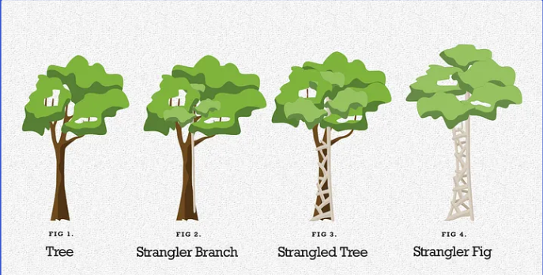

**Incremental process**

1. The Strangler Fig pattern begins by introducing a façade (proxy) between the client app, the legacy system, and the new system. The façade acts as an intermediary. It allows the client app to interact with the legacy system and the new system. Initially, the façade routes most requests to the legacy system.

2. As the migration progresses, the façade incrementally shifts requests from the legacy system to the new system. With each iteration, you implement more pieces of functionality in the new system. This incremental approach gradually reduces the legacy system's responsibilities and expands the scope of the new system. The process is iterative. It allows the team to address complexities and dependencies in manageable stages. These stages help the system remain stable and functional.

3. After you migrate all of the functionality and there are no dependencies on the legacy system, you can decommission the legacy system. The façade routes all requests exclusively to the new system.

4. You remove the façade and reconfigure the client app to communicate directly with the new system. This step marks the completion of the migration.


**Simple Example (in Python)**
* Suppose you have a legacy system for handling user data, and you’re building a new microservice to replace it.

```python
# --- Legacy System ---
class LegacyUserService:
    def get_user(self, user_id):
        print("Fetching user from Legacy System...")
        return {"id": user_id, "name": "Alice (Legacy)"}

# --- New System ---
class NewUserService:
    def get_user(self, user_id):
        print("Fetching user from New System...")
        return {"id": user_id, "name": "Alice (New)"}

# --- Strangler Facade ---
class UserServiceFacade:
    def __init__(self):
        self.legacy_service = LegacyUserService()
        self.new_service = NewUserService()

    def get_user(self, user_id):
        # Gradual migration rule: use new service for user_id > 1000
        if user_id > 1000:
            return self.new_service.get_user(user_id)
        else:
            return self.legacy_service.get_user(user_id)

# --- Client Code ---
facade = UserServiceFacade()

print(facade.get_user(500))    # Uses legacy system
print(facade.get_user(1500))   # Uses new system
```

## Cloud-Native Architecture
### Container Orchestration
#### Liveness and Readiness

Liveness Probe
* Checks if the service is alive (i.e., not stuck or deadlocked).
* If it fails, Kubernetes restarts the container.
* Purpose: Keep the app running by restarting broken instances.

Readiness Probe
* Checks if the service is ready to receive traffic (e.g., finished startup tasks, connected to DB).
* If it fails, Kubernetes stops sending traffic to that pod but does not restart it.
* Purpose: Prevent traffic from hitting an unready service.

In short:
* Liveness = should this container be restarted?
* Readiness = should this container receive traffic yet?

##### Spring Boot Actuator Health Endpoints
Actuator exposes:
* /actuator/health/liveness
* /actuator/health/readiness

In your pod configuration, you point the probes to Actuator:
```yaml
livenessProbe:
  httpGet:
    path: /actuator/health/liveness
    port: 8080

readinessProbe:
  httpGet:
    path: /actuator/health/readiness
    port: 8080
```
Why Actuator matters
* It automatically reports whether your Spring Boot app is alive or ready.
* You can add custom health indicators to reflect DB, message brokers, external services, etc.

## DevTools
### sdkman
SDKMAN is a tool that lets you easily install and manage Java, Maven, and other SDKs.
```bash
curl -s "https://get.sdkman.io" | bash
source "$HOME/.sdkman/bin/sdkman-init.sh"
sdk version
```
#### Java 17
```bash
sdk list java
sdk install java 17.0.16-amzn
sdk default java 17.0.16-amzn
java -version
```
#### Maven
```bash
sdk install maven
mvn -v
...
mvn clean install
...
mvn spring-boot:run
java -jar target/accounts-0.0.1-SNAPSHOT.jar
```


### vscode
#### Extensions
* REST Client, vim, JSON Crack, Prettier
#### Environment variables
.vscode/settings.json
```JSON
{
  "rest-client.environmentVariables": {
    "dev": {
      "ACCOUNTS_URL": "http://localhost:8080",
      "API_KEY": "dev-api-key"
    },
    "qa": {
      "ACCOUNTS_URL": "https://qa.example.com",
      "API_KEY": "qa-api-key"
    },
    "stg": {
      "ACCOUNTS_URL": "https://stg.example.com",
      "API_KEY": "stg-api-key"
    },
    "prd": {
      "ACCOUNTS_URL": "https://api.example.com",
      "API_KEY": "prd-api-key"
    }
  }
}
```
### postman
```bash
brew install --cask postman
```

### IntelliJ IDEA
#### Keystrokes
* Option F1 (⌥ + fn + F1) / 1 Project View (Select in Project View)
* ⌘ = U+2318
* ⌘ F12: File structure popup 

### Docker Desktop
* Extensions / find / Logs Explorer

### RabbitMQ
* RabbitMQ is a reliable and mature messaging and streaming broker, which is easy to deploy on cloud environments, on-premises, and on your local machine. It is currently used by millions worldwide.
* https://www.rabbitmq.com/ / docs / Install and upgrade
```bash
# latest RabbitMQ 4.x
docker run -it --rm --name rabbitmq -p 5672:5672 -p 15672:15672 rabbitmq:4-management
```
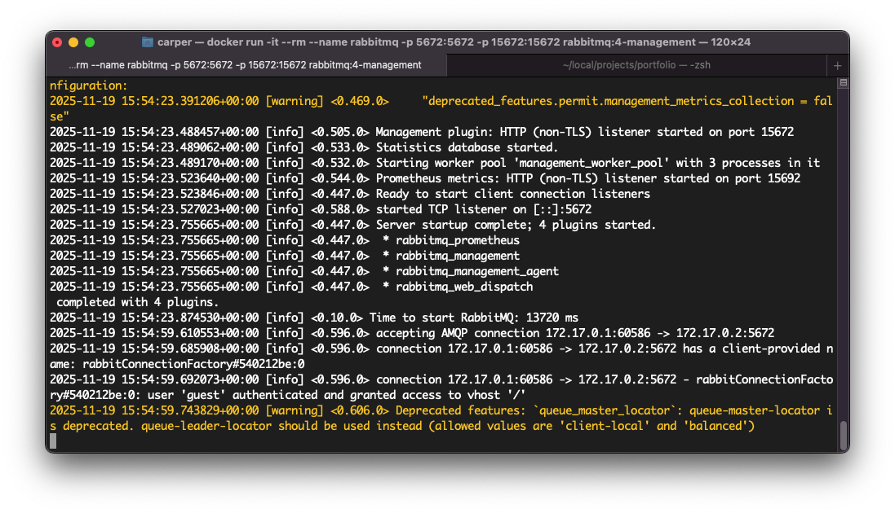

## SpringBoot
### spring initializer
* https://start.spring.io/
* Project: Maven, Language: Java, Spring Boot: 3.5.7
* Group: com.carper, Artifact/Name/Description: accounts/cards/loans/configserver, Package name: com.carper.accounts
* Packaging: Jar, Configuration: YAML, Java: 17 

#### Dependencies
* Microservices
  * Spring Web
  * H2 Database
  * Spring Data JPA
  * Spring Boot Actuator
  * Spring Boot DevTools
  * Spring Cloud Config Client
  * Lombok
  * Validation
* Config Server
  * Spring Cloud Config Server
  * Spring Boot Actuator
* Spring Cloud Bus

### Configuration
* Refactor rename application.properties -> applications.yaml
```YAML
server:
  port: 8080
spring:
  datasource:
    url: jdbc:h2:mem:testdb
    driverClassName: org.h2.Driver
    username: sa
    password: ''
  h2:
    console:
      enabled: true
  jpa:
    database-platform: org.hibernate.dialect.H2Dialect
    hibernate:
      ddl-auto: update
    show-sql: true
```

#### H2
* http://localhost:8080/h2-console
* JDBC URL: jdbc:h2:mem:testdb

#### Lombok
* Settings / Build, Execution, Deployment / Compiler / Annotation Processors / check "Enable annotation processing"

#### Spring Cloud Config Server
 * Spring Cloud Config Server provides an HTTP resource-based API for external configuration (name-value pairs or equivalent YAML content). The server is embeddable in a Spring Boot application, by using the @EnableConfigServer annotation.
```java
@SpringBootApplication
@EnableConfigServer
public class ConfigserverApplication {
	public static void main(String[] args) {
		SpringApplication.run(ConfigserverApplication.class, args);
	}
}
```
application.yaml
```yaml
spring:
  application:
    name: "configserver"
  profiles:
    active: native
  cloud:
    config:
      server:
        native:
          search-locations: "classpath:/config"

server:
  port: 8071
```
```plaintext
resources
└── config
    ├── accounts.yaml
    ├── accounts-prod.yaml
    ├── accounts-qa.yaml
    ├── cards.yaml
    ├── cards-prod.yaml
    ├── cards-qa.yaml
    ├── loans.yaml
    ├── loans-prod.yaml
    ├── loans-qa.yaml
application.yaml
```

#### Spring Cloud Config Client
* A Spring Boot application can take immediate advantage of the Spring Config Server (or other external property sources provided by the application developer).

Adding to `spring-cloud.version`, `dependency` and `dependencyManagement` respectively section into each microservice's pom.xml:
```xml
  <properties>
    <java.version>17</java.version> 
    <spring-cloud.version>2025.0.0</spring-cloud.version> 
  </properties>
  ...
  <dependencies>
    <dependency>
      <groupId>org.springframework.cloud</groupId>
      <artifactId>spring-cloud-starter-config</artifactId>
    </dependency>
  </dependencies>
  ...
  <dependencyManagement>
    <dependencies>
      <dependency>
        <groupId>org.springframework.cloud</groupId>
        <artifactId>spring-cloud-dependencies</artifactId>
        <version>${spring-cloud.version}</version>
        <type>pom</type>
        <scope>import</scope>
      </dependency>
    </dependencies>
  </dependencyManagement>
```
application.yaml
```yaml
server:
  port: 8080
spring:
  application:
    name: "accounts"
  profiles:
    active: "prod"
  datasource:
    url: jdbc:h2:mem:testdb
    driverClassName: org.h2.Driver
    username: sa
    password: ''
  h2:
    console:
      enabled: true
  jpa:
    database-platform: org.hibernate.dialect.H2Dialect
    hibernate:
      ddl-auto: update
    show-sql: true
  config:
    import: "configserver:http://localhost:8071/"
```
#### Configurations from GitHub Repository
* https://github.com/carlosjulioperez/carper-config

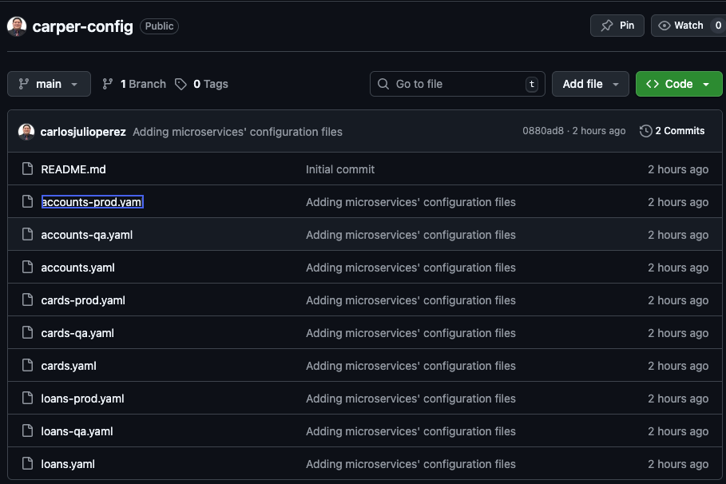

* This is the most recommended approach to get configurations.
 
aplication.yaml:
```yaml
spring:
  application:
    name: "configserver"
  profiles:
    # active: native
    active: git
  cloud:
    config:
      server:
        # native:
          # search-locations: "classpath:/config"
        git:
          uri: "https://github.com/carlosjulioperez/carper-config.git"
          default-label: main
          timeout: 5
          clone-on-start: true
          force-pull: true
encrypt:
  key: "EF14B2CA63AA8A6D3FD5FF6D6464F"

server:
  port: 8071
```

#### Encryption and Decryption properties inside Config Server
* Consider the `encrypt.key` value as 256-bit WEP Key format inside Config Server `application.yaml` file.
* Encrypt the email with help of this endpoint:

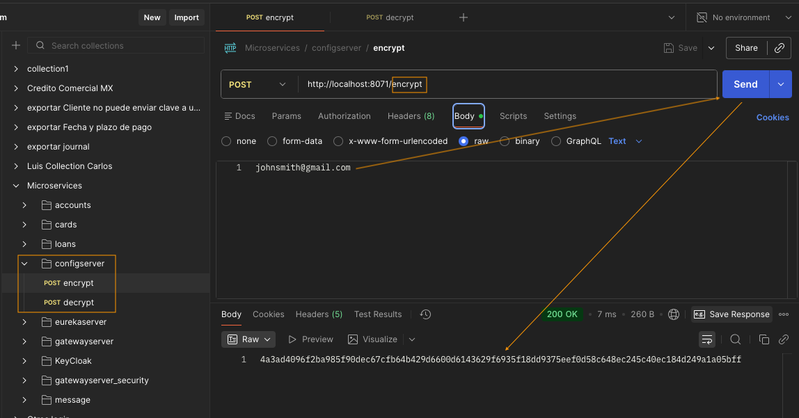

* Change the email value with the `{cipher}` prefix and encrypted data:

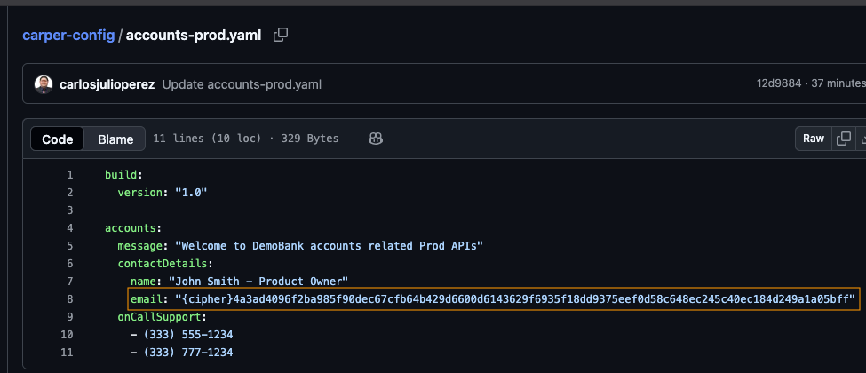

* Navigating to `http://localhost:8071/accounts/prod` we can see the right email's decrypted value:

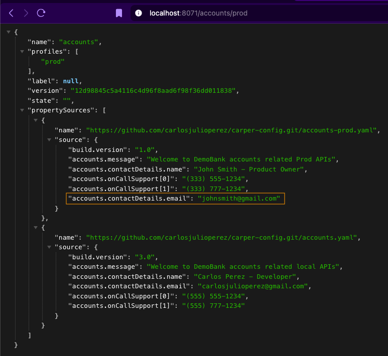

#### Spring Cloud Bus
* Spring Cloud Bus links nodes of a distributed system with a lightweight message broker. This can then be used to broadcast state changes (e.g. configuration changes) or other management instructions.

Add this to configserver and all microservice's pom.xml:
```xml
<dependency>
  <groupId>org.springframework.cloud</groupId>
  <artifactId>spring-cloud-bus</artifactId>
</dependency>
<dependency>
  <groupId>org.springframework.cloud</groupId>
  <artifactId>spring-cloud-starter-bus-amqp</artifactId>
</dependency>
```

#### Spring Cloud Config Monitor
* Spring Cloud Config Monitor facilitates the automatic detection and propagation of configuration changes from a Git repository to connected Spring Cloud Config clients. This functionality, often used in conjunction with Spring Cloud Bus, eliminates the need for manual refreshes of configuration in applications.

##### Hookdeck 
* https://hookdeck.com/
* From webhooks to external event streams, Hookdeck ensures every event is received, processed, and monitored reliably at scale, giving you complete visibility and control.
* Go to Product / Console / Add Destination
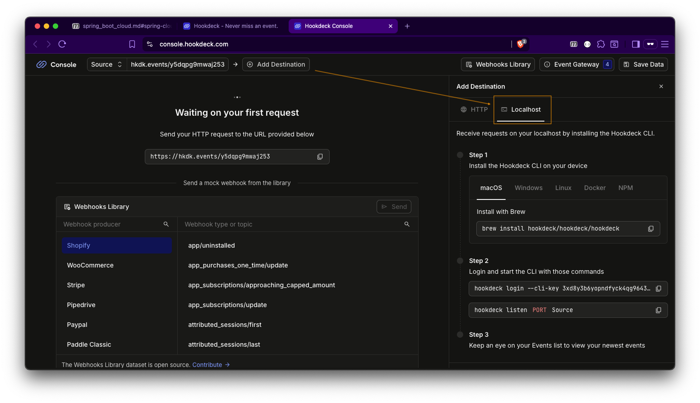
1. Install the Hookdeck CLI on your device
```bash
brew install hookdeck/hookdeck/hookdeck
```
2. Login and start the CLI with those commands
```bash
hookdeck login --cli-key 3xd8y3b6yopndfyck4qg96435ncvsbw2jqeds4ughb8mmlwzy5
hookdeck listen 8071 Source --cli-path /monitor
```
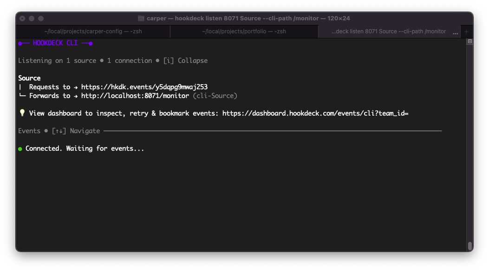

* Go to `carper-config` repository / Settings / Webhooks / Add webhook
  * Payload URL: `https://hkdk.events/y5dqpg9mwaj253`
  * Content type: application/json
  * Click on `Add webhook`
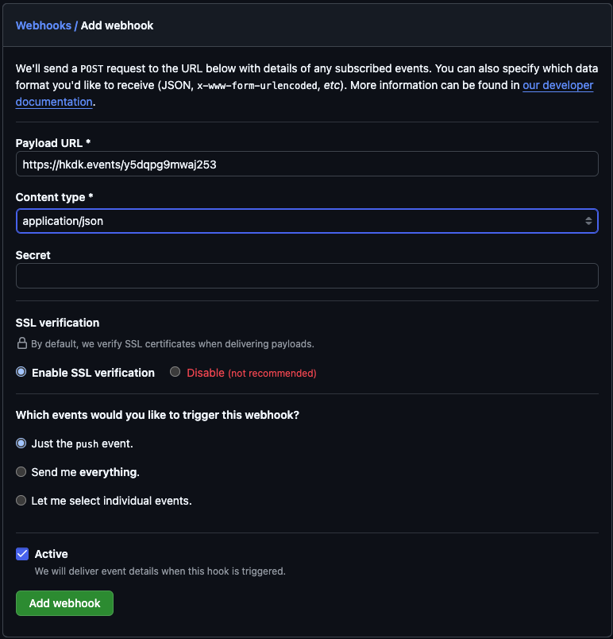
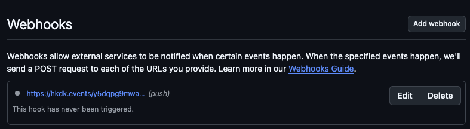

pom.xml
```xml
<dependency>
  <groupId>org.springframework.cloud</groupId>
  <artifactId>spring-cloud-config-monitor</artifactId>
</dependency>
```
#### Liveness and Readiness using Docker Compose and RabbitMQ
docker-compose.yaml
```yaml
services:
  configserver:
    image: "carlosjulioperez/configserver:s6"
    container_name: configserver-ms
    ports:
      - "8071:8071"
    deploy:
      resources:
        limits:
          memory: 700m
    networks:
      - demobank
  accounts:
    image: "carlosjulioperez/accounts:s6"
    container_name: accounts-ms
    ports:
      - "8080:8080"
    deploy:
      resources:
        limits:
          memory: 700m
    networks:
      - demobank
    environment:
      SPRING_APPLICATION_NAME: "accounts"
      SPRING_CONFIG_IMPORT: "configserver:http://configserver:8071/"
      SPRING_PROFILES_ACTIVE: default
  loans:
    image: "carlosjulioperez/loans:s6"
    container_name: loans-ms
    ports:
      - "8090:8090"
    deploy:
      resources:
        limits:
          memory: 700m
    networks:
      - demobank
    environment:
      SPRING_APPLICATION_NAME: "loans"
      SPRING_CONFIG_IMPORT: "configserver:http://configserver:8071/"
      SPRING_PROFILES_ACTIVE: default
  cards:
    image: "carlosjulioperez/cards:s6"
    container_name: cards-ms
    ports:
      - "9000:9000"
    deploy:
      resources:
        limits:
          memory: 700m
    networks:
      - demobank
    environment:
      SPRING_APPLICATION_NAME: "cards"
      SPRING_CONFIG_IMPORT: "configserver:http://configserver:8071/"
      SPRING_PROFILES_ACTIVE: default
networks:
  demobank:
    driver: "bridge"
```

Config Server pom.xml
```xml
<dependency>
  <groupId>org.springframework.boot</groupId>
  <artifactId>spring-boot-starter-actuator</artifactId>
</dependency>
```

application.yaml
```yaml
server:
  port: 8080
spring:
  application:
    name: "accounts"
  profiles:
    active: "prod"
  datasource:
    url: jdbc:h2:mem:testdb
    driverClassName: org.h2.Driver
    username: sa
    password: ''
  h2:
    console:
      enabled: true
  jpa:
    database-platform: org.hibernate.dialect.H2Dialect
    hibernate:
      ddl-auto: update
    show-sql: true
  config:
    import: "configserver:http://localhost:8071/"
  rabbitmq:
    host: "localhost"
    port: 5672
    username: "guest"
    password: "guest"

management:
  endpoints:
    web:
      exposure:
        include: "*"
  health:
    readiness-state:
      enabled: true
    liveness-state:
      enabled: true
  endpoint:
    health:
      probes:
        enabled: true
```

* Start Config server

http://localhost:8071/actuator/health
```json
{
  "status": "UP"
}
```

* http://localhost:8071/actuator/liveness
```json
{
  "name": "actuator",
  "profiles": [
    "liveness"
  ],
  "label": null,
  "version": "636af034f9b9d1fd710514274e762d1d960c921a",
  "state": "",
  "propertySources": []
}
```

http://localhost:8071/actuator/readiness
```json
{
  "name": "actuator",
  "profiles": [
    "readiness"
  ],
  "label": null,
  "version": "636af034f9b9d1fd710514274e762d1d960c921a",
  "state": "",
  "propertySources": []
}
```

* Pushing images
```bash
docker push carlosjulioperez/accounts:s6
docker push carlosjulioperez/loans:s6
docker push carlosjulioperez/cards:s6
docker push carlosjulioperez/configserver:s6
```

##### Running RabbitMQ, Config Server and regarding microservices with Docker compose
```bash
docker compose up -d
```
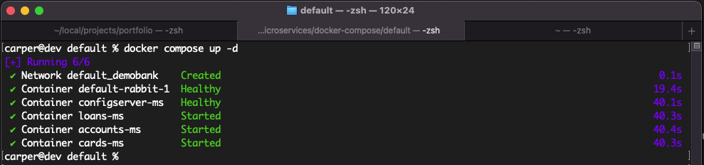

### Annotations
#### @MappedSuperClass
* In JPA (Jakarta Persistence API), @MappedSuperclass is used when you want to share common fields or mappings between multiple entity classes — but the superclass itself is not an entity (so it’s not mapped to a database table).

```java
package com.carper.accounts.entity;

import jakarta.persistence.Column;
import jakarta.persistence.EntityListeners;
import jakarta.persistence.MappedSuperclass;
import lombok.Getter;
import lombok.Setter;
import lombok.ToString;
import org.springframework.data.annotation.CreatedBy;
import org.springframework.data.annotation.CreatedDate;
import org.springframework.data.annotation.LastModifiedBy;
import org.springframework.data.annotation.LastModifiedDate;
import org.springframework.data.jpa.domain.support.AuditingEntityListener;

import java.time.LocalDateTime;

@MappedSuperclass
@EntityListeners(AuditingEntityListener.class)
@Getter @Setter @ToString
public class BaseEntity {

    @CreatedDate
    @Column(updatable = false)
    private LocalDateTime createdAt;

    @CreatedBy
    @Column(updatable = false)
    private String createdBy;

    @LastModifiedDate
    @Column(insertable = false)
    private LocalDateTime updatedAt;

    @LastModifiedBy
    @Column(insertable = false)
    private String updatedBy;
}
```

```java
package com.carper.accounts.entity;

import jakarta.persistence.*;
import lombok.*;

@Entity
@Getter @Setter @ToString @AllArgsConstructor @NoArgsConstructor
public class Accounts extends BaseEntity {

    @Id
    @Column(name="account_number")
    public Long accountNumber;

    @Column(name="customer_id")
    public Long customerId;

    @Column(name="account_type")
    public String accountType;

    @Column(name="branch_address")
    public String branchAddress;
}
```

#### Auto-Increment ID:
* An auto-increment ID is a database-generated unique identifier that increases automatically every time a new record is inserted.
* In a Spring Boot application using JPA (Java Persistence API) and Hibernate, you can configure an entity’s primary key to auto-increment automatically — meaning you don’t have to manually assign an ID before saving it.

```java
package com.carper.accounts.entity;

import jakarta.persistence.*;
import lombok.*;

@Entity
@Getter @Setter @ToString @AllArgsConstructor @NoArgsConstructor
public class Customer extends BaseEntity {

    @Id
    @GeneratedValue(strategy = GenerationType.IDENTITY)
    @Column(name="customer_id")
    public Long customerId;

    public String name;

    public String email;

    @Column(name="mobile_number")
    public String mobileNumber;

}
```

#### GlobalExceptionHandler

* In Spring Boot (Java), @ControllerAdvice and @ExceptionHandler are powerful annotations used for global exception handling across your application. They let you centralize error handling logic instead of writing repetitive try-catch blocks in every controller.

1. **@ControllerAdvice** — Global Exception Handling<br>@ControllerAdvice is a specialized Spring annotation that allows you to handle exceptions across all controllers in one place.<br>You can think of it as an interceptor for exceptions thrown by controller methods.

  ```java
  @ControllerAdvice
  public class GlobalExceptionHandler extends ResponseEntityExceptionHandler {

      @ExceptionHandler(Exception.class)
      public ResponseEntity<ErrorResponseDto> handleGlobalException(Exception exception,
                                                                              WebRequest webRequest){
          ErrorResponseDto errorResponseDTO = new ErrorResponseDto(
                  webRequest.getDescription(false),
                  HttpStatus.INTERNAL_SERVER_ERROR,
                  exception.getMessage(),
                  LocalDateTime.now()
          );
          return new ResponseEntity<>(errorResponseDTO, HttpStatus.INTERNAL_SERVER_ERROR);
      }

      @ExceptionHandler(ResourceNotFoundException.class)
      public ResponseEntity<ErrorResponseDto> handleResourceNotFoundException(ResourceNotFoundException exception,
                                                                                   WebRequest webRequest){
          ErrorResponseDto errorResponseDTO = new ErrorResponseDto(
                  webRequest.getDescription(false),
                  HttpStatus.NOT_FOUND,
                  exception.getMessage(),
                  LocalDateTime.now()
          );
          return new ResponseEntity<>(errorResponseDTO, HttpStatus.NOT_FOUND);
      }
  }
  ```
2. **@ExceptionHandler** — Handling Specific Exceptions<br>Inside a class annotated with @ControllerAdvice, you can use @ExceptionHandler to specify which exception(s) each method should handle.

  ```java
  @ResponseStatus(value = HttpStatus.NOT_FOUND)
  public class ResourceNotFoundException extends RuntimeException {

      public ResourceNotFoundException(String resourceName, String fieldName, String fieldValue) {
          super(String.format("%s not found with given input data %s: '%s'", resourceName, fieldName, fieldValue));

      }
  }
  ```
#### @ConfigurationProperties
* @ConfigurationProperties is a Spring annotation used to bind external configuration properties (like those in application.properties or application.yml) to a Java bean. It allows for easy mapping of properties to a POJO (Plain Old Java Object), making it easier to access and manage configuration values in a type-safe manner.

applications.yaml:
```yaml
accounts:
  message: "Welcome to DemoBank accounts related local APIs"
  contactDetails:
    name: "Carlos Perez - Developer"
    email: "carlosjulioperez@gmail.com"
  onCallSupport:
    - (555) 555-1234
    - (555) 777-1234
```

Record object:
```java
@ConfigurationProperties(prefix = "accounts")
public record AccountsContactInfoDto(String message, Map<String, String> contactDetails, List<String> onCallSupport) {
}
```

```java
import com.carper.accounts.dto.AccountsContactInfoDto;
import org.springframework.boot.context.properties.EnableConfigurationProperties;
...

@EnableConfigurationProperties(value = AccountsContactInfoDto.class)
public class AccountsApplication {

	public static void main(String[] args) {
		SpringApplication.run(AccountsApplication.class, args);
	}

}
```

```java
public class AccountsController {
    @Autowired
    private AccountsContactInfoDto accountsContactInfoDto;

    @GetMapping("/contact-info")
    public ResponseEntity<AccountsContactInfoDto> getContactInfo() {
        return ResponseEntity.status(HttpStatus.OK).body(accountsContactInfoDto);
    }
}
```

### Project's packages
* Folder structure:

```plaintext
src
└── main
    └── java
        └── com
            └── carper
                └── accounts
                    ├── audit
                    ├── constants
                    ├── controller
                    ├── dto
                    ├── entity
                    ├── exception
                    ├── mapper
                    ├── repository
                    ├── service
                        ├── impl
                    └── AccountsApplication
```
* If the packages don't follow the above folder structure, then you must use the commented following annotations in Main Class (AccountsApplication):

```java
package com.carper.accounts;

import io.swagger.v3.oas.annotations.ExternalDocumentation;
import io.swagger.v3.oas.annotations.OpenAPIDefinition;
import io.swagger.v3.oas.annotations.info.Contact;
import io.swagger.v3.oas.annotations.info.Info;
import io.swagger.v3.oas.annotations.info.License;
import org.springframework.boot.SpringApplication;
import org.springframework.boot.autoconfigure.SpringBootApplication;
import org.springframework.data.jpa.repository.config.EnableJpaAuditing;

@SpringBootApplication
/*@ComponentScans({ @ComponentScan("com.carper.accounts.controller") })
@EnableJpaRepositories("com.carper.accounts.repository")
@EntityScan("com.carper.accounts.model")*/
@EnableJpaAuditing(auditorAwareRef = "auditAwareImpl")
@OpenAPIDefinition(
    info = @Info(
        title = "Accounts microservice REST Api Documentation",
        description = "DemoBank microservice REST Api Documentation",
        version = "v1",
        contact = @Contact(
            name = "Carlos Pérez",
            email = "carlosjulioperez@gmail.com",
            url = "https://www.linkedin.com/in/carlosjulioperez/"
        ),
        license = @License(
            name = "Apache 2.0",
            url = "https://www.linkedin.com/in/carlosjulioperez/"
        )
    ),
    externalDocs = @ExternalDocumentation(
        description = "DemoBank microservice REST Api Documentation",
        url = "https://www.linkedin.com/in/carlosjulioperez/"
    )
)
public class AccountsApplication {

	public static void main(String[] args) {
		SpringApplication.run(AccountsApplication.class, args);
	}

}
```

### API Documentation
#### OpenAPI
* The [OpenAPI Specifications](https://www.openapis.org/) provide a formal standard for describing HTTP APIs.
* This allows people to understand how an API works, how a sequence of APIs work together, generate client code, create tests, apply design standards,

#### springdoc-openapi
* [springdoc-openapi](https://springdoc.org/) java library helps to automate the generation of API documentation using spring boot projects. springdoc-openapi works by examining an application at runtime to infer API semantics based on spring configurations, class structure and various annotations.

pom.xml:
```xml
   <dependency>
      <groupId>org.springdoc</groupId>
      <artifactId>springdoc-openapi-starter-webmvc-ui</artifactId>
      <version>2.8.14</version>
   </dependency>
```

#### Swagger
* Swagger originally started as a framework for describing and documenting RESTful APIs. It included both:
  * A specification (how to describe an API)
  * A set of tools for generating documentation, code, and clients.
* Over time, the Swagger Specification was donated to the OpenAPI Initiative (under the Linux Foundation).

* That specification became what we now call OpenAPI Specification (OAS). So:
  * Swagger = Tools
  * OpenAPI = Specification

* Then, visit: http://localhost:8080/swagger-ui.html

### Images
#### Docker
* https://www.docker.com/
* Docker helps developers build, share, run, and verify applications anywhere — without tedious environment configuration or management.

Dockerfile
```dockerfile
#Start with a base image containing Java runtime
FROM openjdk:26-ea-17-jdk-slim

# MAINTAINER instruction is deprecated in favor of using label
#Information around who maintains the image
LABEL "org.opencontainers.image.authors"="carper.com"

# Add the application's jar to the image
COPY target/accounts-0.0.1-SNAPSHOT.jar accounts-0.0.1-SNAPSHOT.jar

# execute the application
ENTRYPOINT ["java", "-jar", "accounts-0.0.1-SNAPSHOT.jar"]
```

Adding `packaging` section to accounts' pom.xml:
```xml
<version>0.0.1-SNAPSHOT</version>
<packaging>jar</packaging>
```

Docker terminal commands:
```bash
# 1. Log in to Docker Hub
docker login
# 2. Build your image under your username
docker build -t carlosjulioperez/accounts:s4 .
# 3. Push to Docker Hub
docker push carlosjulioperez/accounts:s4

docker images
REPOSITORY                  TAG       IMAGE ID       CREATED        SIZE
carlosjulioperez/accounts   s4        d1f0ce1c2a31   16 hours ago   551MB

docker inspect <image_id> (3 or 4 characters)
docker inspect d1f
```
```json
[
    {
        "Id": "sha256:d1f0ce1c2a31a6f2d0f472d3a64c5bc8200efa25cea4e9ef7283c4f495e9f0d6",
        "RepoTags": [
            "carlosjulioperez/accounts:s4"
        ],
        "RepoDigests": [],
        "Parent": "",
        "Comment": "buildkit.dockerfile.v0",
        "Created": "2025-11-10T22:22:53.369052197Z",
        "DockerVersion": "",
        "Author": "",
        "Config": {
            "Hostname": "",
            "Domainname": "",
            "User": "",
            "AttachStdin": false,
            "AttachStdout": false,
            "AttachStderr": false,
            "Tty": false,
            "OpenStdin": false,
            "StdinOnce": false,
            "Env": [
                "PATH=/usr/local/openjdk-26/bin:/usr/local/sbin:/usr/local/bin:/usr/sbin:/usr/bin:/sbin:/bin",
                "JAVA_HOME=/usr/local/openjdk-26",
                "LANG=C.UTF-8",
                "JAVA_VERSION=26-ea+17"
            ],
            "Cmd": null,
            "Image": "",
            "Volumes": null,
            "WorkingDir": "",
            "Entrypoint": [
                "java",
                "-jar",
                "accounts-0.0.1-SNAPSHOT.jar"
            ],
            "OnBuild": null,
            "Labels": {
                "org.opencontainers.image.authors": "carper.com"
            }
        },
        "Architecture": "amd64",
        "Os": "linux",
        "Size": 551080288,
        "GraphDriver": {
            "Data": {
                "LowerDir": "/var/lib/docker/overlay2/eb06b8901fe21cd0c9ae13aec8289be463be78edd121b8d4b8a115452ce86038/diff:/var/lib/docker/overlay2/cfa7f89eacba3f090c1e07e4c9a9a7f1c159f563d7dd334679185401200adc9c/diff:/var/lib/docker/overlay2/624b59fce203b15ba7fb1106718f6d3bd35ad093add101f097a8ff2cd476428c/diff",
                "MergedDir": "/var/lib/docker/overlay2/p106rg79z371j85vbsjgne9ea/merged",
                "UpperDir": "/var/lib/docker/overlay2/p106rg79z371j85vbsjgne9ea/diff",
                "WorkDir": "/var/lib/docker/overlay2/p106rg79z371j85vbsjgne9ea/work"
            },
            "Name": "overlay2"
        },
        "RootFS": {
            "Type": "layers",
            "Layers": [
                "sha256:1d46119d249f7719e1820e24a311aa7c453f166f714969cffe89504678eaa447",
                "sha256:aeb8eb818d560d73d995861c727985da874ea853c12ee6e57934bb5fd7924b36",
                "sha256:7f0bf75582dea8b2ba7cf4cf509c9feefada1d360660a285c128194943af66c0",
                "sha256:ad19eaba2caa3b7450de41f52cfef8a5d7dcb6aa91bc2537d99e93ab15a8af34"
            ]
        },
        "Metadata": {
            "LastTagTime": "2025-11-11T14:43:37.520063168Z"
        }
    }
]
```

```bash
docker run -p 8080:8080 carlosjulioperez/accounts:s4
docker run -d -p 8080:8080 carlosjulioperez/accounts:s4 (detached)
docker ps
docker ps -a

docker start <container_id>
docker stop <container_id>
```

#### Cloud Native Buildpacks
* https://buildpacks.io/
* Cloud Native Buildpacks (CNBs) transform your application source code into container images that can run on any cloud. With buildpacks, organizations can concentrate the knowledge of container build best practices within a specialized team, instead of having application developers across the organization individually maintain their own Dockerfiles. This makes it easier to know what is inside application images, enforce security and compliance requirements, and perform upgrades with minimal effort and intervention.
* Buildpacks were first conceived by Heroku in 2011. Since then, they have been adopted by Cloud Foundry and other PaaS such as Google App Engine, Gitlab, Knative, Deis, Dokku, and Drie.

Adding `packaging` section to loans' pom.xml:
```xml
<version>0.0.1-SNAPSHOT</version>
<packaging>jar</packaging>
```

Adding `image` section into `configuration` of `spring-boot-maven-plugin` to loans' pom.xml:
```xml
    <artifactId>spring-boot-maven-plugin</artifactId>
    <configuration>
      <image>
          <name>carlosjulioperez/${project.artifactId}:s4</name>
      </image>
```

Generating docker image into loans's directory:
```bash
mvn spring-boot:build-image
docker images

REPOSITORY                                 TAG       IMAGE ID       CREATED        SIZE
carlosjulioperez/accounts                  s4        d1f0ce1c2a31   17 hours ago   551MB
paketobuildpacks/ubuntu-noble-run-tiny     0.0.38    c1e27ee34940   7 days ago     22MB
carlosjulioperez/loans                     s4        21bd56c748bd   45 years ago   280MB
paketobuildpacks/builder-noble-java-tiny   latest    8fdefaa524ce   45 years ago   813MB

docker run -p 8090:8090 carlosjulioperez/loans:s4
```

#### Google Jib
* https://github.com/GoogleContainerTools/jib
* Jib builds optimized Docker and OCI images for your Java applications without a Docker daemon - and without deep mastery of Docker best-practices. It is available as plugins for Maven and Gradle and as a Java library.

Adding `packaging` section to cards' pom.xml:
```xml
<version>0.0.1-SNAPSHOT</version>
<packaging>jar</packaging>
```

Adding `jib-maven-plugin` section to cards' pom.xml:
```xml
<plugin>
  <groupId>com.google.cloud.tools</groupId>
  <artifactId>jib-maven-plugin</artifactId>
  <version>3.4.6</version>
  <configuration>
    <to>
      <image>carlosjulioperez/${project.artifactId}:s4</image>
    </to>
  </configuration>
</plugin>
```

Build your container image with:
```bash
mvn compile jib:dockerBuild
docker images

REPOSITORY                                 TAG       IMAGE ID       CREATED        SIZE
carlosjulioperez/accounts                  s4        d1f0ce1c2a31   17 hours ago   551MB
paketobuildpacks/ubuntu-noble-run-tiny     0.0.38    c1e27ee34940   7 days ago     22MB
paketobuildpacks/builder-noble-java-tiny   latest    8fdefaa524ce   45 years ago   813MB
carlosjulioperez/loans                     s4        21bd56c748bd   45 years ago   280MB
carlosjulioperez/cards                     s4        add8163f6cc7   55 years ago   326MB

docker run -p 9000:9000 carlosjulioperez/cards:s4
```

Build your container image with: (Pushing to Docker Hub)
```bash
mvn compile jib:build
```

### Pushing Docker images to Docker Hub
* https://hub.docker.com/repositories/carlosjulioperez

```bash
# 1. Log in to Docker Hub
docker login
# 2. Build your image under your username
docker build -t carlosjulioperez/accounts:s4 .
# 3. Push to Docker Hub
docker push carlosjulioperez/accounts:s4

The push refers to repository [docker.io/carlosjulioperez/accounts]
ad19eaba2caa: Pushing [====================>                              ]  25.59MB/61.11MB
7f0bf75582de: Pushing [=>                                                 ]     15MB/403.5MB
aeb8eb818d56: Pushed 
1d46119d249f: Pushing [=============>                                     ]  21.75MB/78.62MB

docker push carlosjulioperez/loans:s4
docker pull carlosjulioperez/cards:s4
```

### Docker Compose
* https://docs.docker.com/compose/
* Docker Compose is a tool for defining and running multi-container applications. It is the key to unlocking a streamlined and efficient development and deployment experience.
* Compose simplifies the control of your entire application stack, making it easy to manage services, networks, and volumes in a single YAML configuration file. Then, with a single command, you create and start all the services from your configuration file.

docker-compose.yaml:
```yaml
services:
  accounts:
    image: "carlosjulioperez/accounts:s4"
    container_name: accounts-ms
    ports:
      - "8080:8080"
    deploy:
      resources:
        limits:
          memory: 700m
    networks:
      - demobank
  loans:
    image: "carlosjulioperez/loans:s4"
    container_name: loans-ms
    ports:
      - "8090:8090"
    deploy:
      resources:
        limits:
          memory: 700m
    networks:
      - demobank
  cards:
    image: "carlosjulioperez/cards:s4"
    container_name: cards-ms
    ports:
      - "9000:9000"
    deploy:
      resources:
        limits:
          memory: 700m
    networks:
      - demobank
networks:
  demobank:
    driver: "bridge"
```
```bash
docker compose version
docker compose up -d
docker compose down

docker compose stop
docker compose start
```
